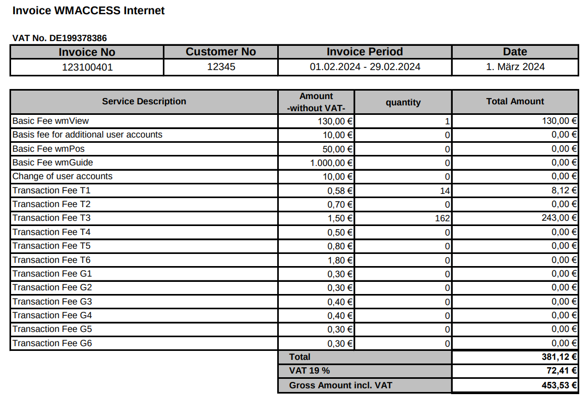

PDF Text Extractor and Parser
============================

This tool extracts specific information from PDF files
based on user-defined rules, converting the
content into structured data (like XML or JSON).

PDFs, unlike XML or HTML, do not have a built-in data structure or hierarchy.
They primarily define the position and style of text.
This tool bridges that gap by allowing you to create rules
based on text position or data patterns (e.g., numbers, dates)
to parse documents consistently.


## Use Cases

### 1. Extract Billing Information

If your credit card company or utility provider
sends billing statements as PDFs, you can use this
tool to extract transaction details automatically.





**Example XML Output:**

```xml
<bill>
  <date>2025-10-25T09:11:55.000+09:00</date>
  <amount>20,000</amount>
  <description>ABC restaurant</description>
</bill>
```


### 2. Extract Insurance Information


**Example CSV Output:**

```text
2025-10-25; 13,123; title...
```


---


Prerequisites
-----------------------------------------

| Software     | Required Version |
|:------------:|:---------:|
| nim          | >= 2.0.2  |
| poppler-glib | poppler-glib-dev 22.12.0-2+deb12u1 >= |


---


Installation
-----------------------------------------

### Build on Debian Bookworm
- 1. Install dependencies:

```shell
$ sudo apt install libpoppler-glib-dev
```

- 2. Install Nim (>= 2.0.2)

    *(Follow official Nim installation instructions if not already installed)*

- 3. Build

```shell
$ git clone https://github.com/kuri65536/pdf_text_parser
$ cd pdf_text_parser
$ nimble build
```


### Build with mingw64 (Windows)

*(Under construction)*


-----


## Usage

```shell
$ ./pdf_text_parser [options] [files]
```

  * **[options]**: See the table below.
  * **[files]**: One or more PDF files to parse.


### Options

| Option    | Short | Parameter | Description |
|:----------|:--:|:------------:|:------------|
| `--rules` | -r | `file-name`  | **Required.** Specifies the INI file for extraction rules. [1] |

[1]: #option---rules


#### option: --rules
Specifies the path to the INI file
that defines the extraction rules.

**Usage:** `--rules [file-name]` or `-r [file-name]`

**Example:**
`$ ./pdf_text_parser -r a_sample_rule.ini target.pdf`


-----


### The Extract Rules File
The extract rules file is the `ini file` format and
procceed a line by lines.

see the examples in the `tests/` directory:
[test_ini](tests/test_ini.nim),
[test_ini2](tests/test_ini2.nim),
or [test_ini3](tests/test_ini3.nim)


#### Example Rule File

```ini
; Rules in the global (top-level) section
extract = abc, 100, 100, 200, 200
extract = def, 100, 110, 200, 200
extract = ghi, 100, 120, 200, 200

format_csv = abc, def, ghi
```


#### Example Result
If the PDF contains "1111" in the first area (assigned to `abc`),
"2222" in the second (assigned to `def`),
and "3333" in the third (assigned to `ghi`),
this rule file will generate the following CSV output:

```csv
1111,2222,3333
```


-----


### Rule Definitions

#### The Rule: 'extract'

This rule extracts text from a specific region
(defined by coordinates) of the PDF pages.


```text
extract = [variable_name], [x1], [y1], [x2], [y2]
```

| Position | Value | Description   |
|:--------:|:-----:|---------------|
| 1 | `variable_name` | The name of the extracted text |
| 2        | `x1`  | the **left** coordinate of the area to be extracted |
| 3        | `y1`  | the **top**  coordinate of the area |
| 4        | `x2`  | the **right** coordinate of the area |
| 5        | `y2`  | the **bottom** coordinate of the area |


-----


#### The Rule: 'parse'

This rule specifies the parse operation for the extracted text.

```text
parse = [new_name], [source_name], [type], [format1], [format2]

parse = name2, name1, date-time, yyyy/mm/dd, yyyy
parse = name3, name1, date-time, yyyy/mm/dd, mm
```

| Position | Value   | Description   |
|:--------:|:-------:|:-------------:|
| 1  | `new_name`    | The name of the new parsed text |
| 2  | `source_name` | The variable name from `extract` to parse |
| 3  | `type`        | the data type to parse, see   |
| 4  | `format1`     | the *input* format to parse   |
| 5  | `format2`     | the *output* format to output |

the format text depend on the `type` specified.

| Type      | Description   |
|:---------:|:--------------|
| date-time | Parses a date/time string. |
| string    | Parses a string. |


- Parsing `date-time` just passes the format parameter to
    the nim-lang `times.parse` function.  
    please check the
    [nim-lang times.parse](https://nim-lang.org/docs/times.html#parsing-and-formatting-dates)
    function manual.


---


Roadmap (Under Construction)
-----------------------------------------

[under construction]: #under-construction

The following features are planned:

- XML output format.
- JSON output format.
- Grouping rules into INI sections (e.g., `[Page1]`, `[PageHeader]`).
- The pair extraction:
    extracts the attribute and the value in a same line
    (e.g. table data)
- Expanded date-time parsing (full support for nim-lang `times` module).


---


License
-----------------------------------------
MIT (see `LICENSE` file)


---


Information
-----------------------------------------
If you have attract or thank to this project,
Welcome to help or support by your donations.


[![img-bitcoin]][lnk-bitcoin]
&nbsp;&nbsp;or&nbsp;&nbsp;
[![img-etherium]][lnk-bitcoin]

- [bitcoin:39Qx9Nffad7UZVbcLpVpVanvdZEQUanEXd][lnk-bitcoin]
- [ethereum:0x9d03b1a8264023c3ad8090b8fc2b75b1ba2b3f0f][lnk-bitcoin]
- or [liberapay](https://liberapay.com/kuri65536) .

[lnk-bitcoin]:  https://kuri65536.bitbucket.io/donation.html?message=thank-for-pdf_toc_outlines
[img-bitcoin]:  https://github.com/user-attachments/assets/abce4347-bcb3-42c6-a9e8-1cd12f1bd4a5
[img-etherium]: https://github.com/user-attachments/assets/d1bdb9a8-9c6f-4e74-bc19-0d0bfa041eb2

